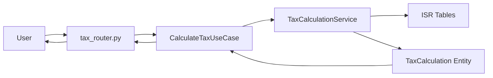
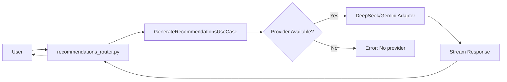

# 🏗️ Arquitectura Modular (Module-First + Hexagonal)

## 📁 Estructura del Proyecto

```
mimo/
├── src/                                    # Nueva arquitectura modular
│   ├── tax_calculation/                   # 📊 Módulo de cálculo ISR
│   │   ├── domain/                        # Core: Lógica de negocio
│   │   │   ├── entities/
│   │   │   │   └── tax_calculation.py    # TaxCalculation entity
│   │   │   ├── services/
│   │   │   │   └── tax_calculation_service.py  # Cálculo ISR
│   │   │   └── value_objects/
│   │   │       └── tax_data.py           # TaxpayerInfo, IncomeData
│   │   ├── application/                   # Use Cases
│   │   │   └── calculate_tax_use_case.py # Orquestación del cálculo
│   │   └── infrastructure/                # Adapters
│   │       └── api/
│   │           └── tax_router.py         # REST API adapter
│   │
│   ├── recommendations/                   # 🤖 Módulo de recomendaciones AI
│   │   ├── domain/
│   │   │   └── ports/
│   │   │       └── recommendation_provider.py  # Port interface
│   │   ├── application/
│   │   │   └── generate_recommendations_use_case.py
│   │   └── infrastructure/
│   │       ├── api/
│   │       │   └── recommendations_router.py   # REST API adapter
│   │       ├── providers/                      # Driven adapters
│   │       │   ├── deepseek_adapter.py
│   │       │   └── gemini_adapter.py
│   │       └── prompts/
│   │           └── recommendation_prompts.py
│   │
│   ├── multi_agent/                       # 🎭 Módulo de análisis multi-agente
│   │   ├── domain/
│   │   │   └── ports/
│   │   │       ├── multi_agent_provider.py     # Port interface
│   │   │       └── memory.py                   # MemoryStore port
│   │   ├── application/
│   │   │   ├── generate_multi_agent_analysis_use_case.py
│   │   │   ├── multi_agent_chat_use_case.py
│   │   │   └── multi_agent_debate_service.py   # Domain service
│   │   └── infrastructure/
│   │       ├── api/
│   │       │   ├── multi_agent_router.py       # REST API adapter
│   │       │   └── multi_agent_chat_router.py
│   │       ├── providers/                      # Driven adapters
│   │       │   ├── deepseek_adapter.py
│   │       │   └── gemini_adapter.py
│   │       ├── litellm/
│   │       │   └── adapter.py                  # LiteLLM integration
│   │       ├── memory/
│   │       │   └── faiss_memory.py            # FAISS adapter
│   │       └── prompts/
│   │           └── multi_agent_prompts.py
│   │
│   ├── auth/                              # 🔐 Módulo de autenticación
│   │   └── infrastructure/                # Infrastructure-only module
│   │       ├── api/
│   │       │   └── auth_router.py        # REST API adapter
│   │       ├── oauth_service.py          # Google OAuth adapter
│   │       └── dependencies.py           # FastAPI auth dependencies
│   │
│   ├── shared/                            # 🔧 Shared kernel
│   │   ├── domain/
│   │   │   ├── constants/
│   │   │   │   └── isr_tables.py        # ISR tax tables (2024-2025)
│   │   │   ├── value_objects/           # Shared value objects
│   │   │   └── ports/
│   │   │       └── repositories.py      # UsageRepository port
│   │   └── infrastructure/
│   │       ├── api/
│   │       │   ├── middleware/          # Error handlers, logging
│   │       │   └── schemas/             # Shared DTOs
│   │       ├── config/
│   │       │   ├── settings.py          # Pydantic Settings
│   │       │   └── dependency_injection.py  # DI Container
│   │       ├── logging/
│   │       │   └── structured_logger.py # JSON logging
│   │       └── persistence/
│   │           └── sqlite_usage_repository.py
│   │
│   └── main.py                           # FastAPI application entry point
│
└── templates/                            # Frontend (calculator.html)
```

## 🎯 Principios de Arquitectura

### 1. Module-First (Módulo Primero)

Cada módulo representa un **bounded context** con su propia estructura hexagonal interna:

- **tax_calculation**: Cálculo de ISR anual
- **recommendations**: Recomendaciones fiscales con AI
- **multi_agent**: Análisis multi-agente con debate
- **auth**: Autenticación OAuth (infrastructure-only)
- **shared**: Código compartido entre módulos

### 2. Hexagonal Architecture (por módulo)

Cada módulo sigue capas hexagonales:

```
domain/           → Core (entities, services, ports)
application/      → Use cases (orchestration)
infrastructure/   → Adapters (API, providers, databases)
```

### 3. Dependency Rule

```
infrastructure → application → domain
     ↓              ↓            ↓
  Adapters     Use Cases    Business Logic
```

Las dependencias siempre apuntan hacia adentro (domain no conoce application ni infrastructure).

### 4. Ports & Adapters

**Ports (interfaces):**

- `RecommendationProvider` → Para proveedores de AI (recommendations)
- `MultiAgentProvider` → Para proveedores multi-agente
- `MemoryStore` → Para almacenamiento de conversaciones
- `UsageRepository` → Para tracking de uso diario

**Adapters (implementaciones):**

- `DeepSeekRecommendationAdapter`, `GeminiRecommendationAdapter`
- `DeepSeekMultiAgentAdapter`, `GeminiMultiAgentAdapter`
- `FaissMemoryStore`
- `SqliteUsageRepository`

### 5. Convenciones de Imports

```python
# ✅ CORRECTO: Imports directos desde archivos
from src.tax_calculation.domain.entities.tax_calculation import TaxCalculation
from src.recommendations.domain.ports.recommendation_provider import RecommendationProvider
from src.shared.domain.constants.isr_tables import get_tabla_isr

# ❌ INCORRECTO: Nunca usar __init__.py para exports
from src.tax_calculation.domain import TaxCalculation  # NO!
```

**Razón:** Los `__init__.py` están **vacíos** por convención para evitar imports circulares.

---

## 🔄 Flujos de Datos

### Cálculo de Impuestos



### Recomendaciones AI



### Multi-Agent Analysis

**Ubicación:** `src/infrastructure/config/settings.py`

**Uso:**

```python
from src.infrastructure.config.settings import get_settings

settings = get_settings()

print(settings.google_client_id)
print(settings.daily_recommendations_limit)
print(settings.has_deepseek_configured())
```

### 3. **Repositorio de Uso** ✅ COMPLETO

**Ubicación:** `src/infrastructure/persistence/sqlite_usage_repository.py`

**Uso:**

```python
from datetime import date
from src.infrastructure.persistence.sqlite_usage_repository import SqliteUsageRepository

repo = SqliteUsageRepository()
usage = repo.get_usage_count("user_123", date.today())
remaining = repo.get_remaining_usage("user_123", date.today(), daily_limit=3)
```

### 4. **Recomendaciones AI** ✅ COMPLETO

**Ubicación:** `src/infrastructure/ai_providers/recommendation_adapters.py`

**Endpoints:**

- `POST /api/recommendations` - Generate recommendations
- `POST /api/recommendations/stream` - Generate with streaming (SSE)
- `GET /api/recommendations/usage` - Check usage limits

**Arquitectura:**

```
API Request → Recommendations Router → Generate Recommendations Use Case
    ↓
RecommendationProvider (priority: DeepSeek → Gemini → Fallback)
    ↓
AI Provider Adapters (wrapping fiscal_recommendations.py generators)
    ↓
Usage Repository (rate limiting check)
    ↓
API Response (Markdown recommendations + usage info)
```

**Características:**

- ✅ Adaptadores que implementan `RecommendationProvider` port
- ✅ Rate limiting (3/día por defecto, configurable)
- ✅ Streaming con Server-Sent Events
- ✅ Autenticación requerida (Google OAuth)
- ✅ Fallback automático entre proveedores

**Uso:**

```python
from src.infrastructure.config.dependency_injection import get_container

container = get_container()
use_case = container.get_recommendations_use_case()

# Check usage
usage_info = use_case.get_usage_info("user_123")
print(f"Remaining: {usage_info['remaining_usage']}/{usage_info['daily_limit']}")
```

### 5. **Análisis Multi-Agente** ✅ COMPLETO

**Ubicación:** `src/infrastructure/ai_providers/multi_agent_adapters.py`

**Endpoints:**

- `POST /api/multi-agent-analysis` - Generate multi-agent analysis
- `POST /api/multi-agent-analysis/stream` - Generate with streaming (SSE)
- `GET /api/multi-agent-analysis/usage` - Check usage limits

**Arquitectura:**

```
API Request → Multi-Agent Router → Generate Multi-Agent Analysis Use Case
    ↓
MultiAgentProvider (priority: DeepSeek → Gemini)
    ↓
Multi-Agent Adapters (wrapping multi_agent_analysis.py)
    ↓
AgentFactory → FiscalExpertAgent (x3) + ModeratorAgent
    ↓
Multi-Agent Conversation Orchestrator (3 rounds + voting + conclusion)
    ↓
Usage Repository (rate limiting check)
    ↓
API Response (Expert profiles, rounds, voting, conclusion + usage info)
```

**Características:**

- ✅ Adaptadores que implementan `MultiAgentProvider` port
- ✅ Rate limiting compartido con recomendaciones (3/día)
- ✅ Streaming con Server-Sent Events para debate en tiempo real
- ✅ Autenticación requerida (Google OAuth)
- ✅ Fallback automático DeepSeek → Gemini
- ✅ 3 expertos con personalidades/profesiones randomizadas
- ✅ Sistema de votación y conclusión final

**Uso:**

```python
from src.infrastructure.config.dependency_injection import get_container

container = get_container()
use_case = container.get_multi_agent_use_case()

# Check if user can generate
can_generate = use_case.can_generate("user_123")
print(f"Can generate: {can_generate}")
```

### 6. **Autenticación OAuth** ✅ COMPLETO

**Ubicación:** `src/infrastructure/auth/`

**Endpoints:**

- `GET /auth/google` - Initiate OAuth login
- `GET /auth/callback` - Handle OAuth callback
- `GET /auth/logout` - Logout user
- `GET /auth/status` - Check authentication status

**Arquitectura:**

```
User → /auth/google
    ↓
GoogleOAuthService.get_authorization_url()
    ↓
Redirect to Google OAuth consent page
    ↓
User authorizes → Google redirects to /auth/callback
    ↓
GoogleOAuthService.authenticate_user()
    ├─ exchange_code_for_token()
    ├─ verify_and_decode_token()
    └─ store_user_in_session()
    ↓
Redirect to /calculator (authenticated)
```

**Componentes:**

- ✅ `GoogleOAuthService`: Servicio completo de OAuth (authorization_url, token exchange, verification)
- ✅ Auth dependencies: `get_current_user()`, `get_user_id()`, `get_current_user_optional()`
- ✅ Auth router: Endpoints de login, callback, logout, status
- ✅ Manejo de proxy headers (Railway/Heroku compatible)
- ✅ Clock skew tolerance (10 segundos)

**Uso en otros routers:**

```python
from src.infrastructure.auth.dependencies import get_user_id

@router.post("/some-protected-endpoint")
async def protected_endpoint(
    user_id: str = Depends(get_user_id),  # ← Automáticamente valida autenticación
):
    # user_id garantizado como string válido
    pass
```

## 🔄 Pendiente de Migrar

### 1. **Tests** ⏳ PENDIENTE

**Plan:**

- Extraer a `src/infrastructure/auth/google_oauth_adapter.py`
- Crear router en `src/api/v1/routers/auth_router.py`
- Implementar dependencias de FastAPI en `src/api/v1/dependencies/auth_dependencies.py`

## 🎯 Ventajas de la Nueva Arquitectura

### 1. **Testabilidad**

```python
# Antes: difícil de testear (dependencias hardcodeadas)
def test_old():
    # Necesitas base de datos real, APIs reales, etc.
    pass

# Ahora: fácil de testear (inyección de dependencias)
def test_new():
    mock_repository = Mock(UsageRepository)
    mock_repository.get_usage_count.return_value = 0

    use_case = GenerateRecommendationsUseCase(
        providers=[mock_provider],
        usage_repository=mock_repository,
        daily_limit=3
    )

    result = use_case.execute(request)
    assert result is not None
```

### 2. **Separación de Concerns**

- **Dominio:** Lógica de negocio pura (no sabe de FastAPI, SQLite, etc.)
- **Aplicación:** Casos de uso (orquestación)
- **Infraestructura:** Detalles técnicos (DB, APIs, Auth)
- **API:** Contratos HTTP (requests/responses)

### 3. **Mantenibilidad**

- Archivos más pequeños y enfocados
- Responsabilidades claras
- Fácil de navegar

### 4. **Extensibilidad**

- Agregar nuevo proveedor AI: Implementa `RecommendationProvider`
- Cambiar de SQLite a PostgreSQL: Implementa `UsageRepository`
- Agregar GraphQL: Usa mismos casos de uso

## 📋 Checklist de Migración

- [x] ✅ Estructura de carpetas creada
- [x] ✅ Configuración centralizada (Settings)
- [x] ✅ Entidades de dominio (TaxCalculation)
- [x] ✅ Value objects (TaxpayerInfo, IncomeData, DeductionData)
- [x] ✅ Servicios de dominio (TaxCalculationService)
- [x] ✅ Puertos definidos (repositories, ai_providers)
- [x] ✅ Repositorio SQLite implementado
- [x] ✅ Casos de uso (CalculateTax, GenerateRecommendations)
- [x] ✅ Router de cálculo de impuestos
- [x] ✅ Schemas de API (DTOs)
- [x] ✅ DI Container
- [x] ✅ Nuevo main.py funcional
- [x] ✅ Adaptar recomendaciones AI
- [x] ✅ Router de recomendaciones con streaming
- [x] ✅ Adaptadores AI (DeepSeek, Gemini, Fallback)
- [x] ✅ Adaptar multi-agent analysis
- [x] ✅ Router de multi-agent con streaming
- [x] ✅ Adaptadores Multi-Agent (DeepSeek, Gemini)
- [x] ✅ Extraer autenticación OAuth
- [x] ✅ Auth service (GoogleOAuthService)
- [x] ✅ Auth dependencies (get_current_user, get_user_id)
- [x] ✅ Auth router (/auth/google, /auth/callback, /logout)
- [ ] ⏳ Tests unitarios
- [ ] ⏳ Tests de integración
- [ ] ⏳ Middleware de errores
- [ ] ⏳ Rate limiting middleware
- [ ] ⏳ Documentación de API (OpenAPI)

## 🔬 Testing

### Ejecutar tests de la nueva arquitectura:

```bash
# Test de carga de módulos
uv run python -c "from src.api.main import app; print('✅ OK')"

# Test de cálculo de impuestos
uv run python -c "
from src.application.calculate_tax_use_case import *
use_case = CalculateTaxUseCase()
req = CalculateTaxRequest(
    taxpayer_name='Test',
    fiscal_year=2025,
    monthly_gross_income=12600,
    bonus_days=15,
    vacation_days=12,
    vacation_premium_percentage=0.25,
    general_deductions=71000,
    ppr_deductions=15000,
    education_deductions=25000
)
response = use_case.execute(req)
print(f'Balance: \${response.calculation.balance_in_favor:,.2f}')
"
```

## �️ Error Handling Middleware ✅

**Estado:** Completo

### Implementación

Middleware centralizado para manejo consistente de errores en `src/api/middleware/error_handler.py`:

**Características:**

- **Respuestas estandarizadas**: Formato JSON consistente con `error`, `message`, `status_code`, `details`
- **Tres tipos de handlers**:
  - `http_exception_handler`: Maneja errores HTTP 4xx/5xx (HTTPException, 401, 403, 404, 500)
  - `validation_exception_handler`: Errores de validación 422 con detalles de campos
  - `generic_exception_handler`: Captura excepciones inesperadas como 500
- **Logging comprehensivo**: Registra errores con contexto (path, method, user_id, error_type)
- **Request logging middleware**: Log de todas las requests/responses con duración

**Integración:**

```python
# En src/api/main.py
app.add_exception_handler(StarletteHTTPException, http_exception_handler)
app.add_exception_handler(RequestValidationError, validation_exception_handler)
app.add_exception_handler(Exception, generic_exception_handler)
app.middleware("http")(log_requests_middleware)
```

**Formato de respuesta:**

```json
{
  "error": "validation_error",
  "message": "Validation failed",
  "status_code": 422,
  "details": [
    {
      "field": "monthly_income",
      "message": "Input should be greater than 0"
    }
  ]
}
```

## �📚 Próximos Pasos

1. ✅ **Completar migración de AI recommendations** (Done)
2. ✅ **Implementar middleware de errores** (Done)
3. **Agregar tests unitarios y de integración**
4. **Documentar API con OpenAPI/Swagger**
5. **Optimizar con caching (Redis)**
6. **Agregar logging estructurado con JSON**

## 🤝 Contribuir

Al trabajar en este proyecto, sigue estas reglas:

1. **Todo código en inglés** (nombres de variables, funciones, clases, comentarios)
2. **Principios SOLID** obligatorios
3. **Type hints** en todas las funciones
4. **Sin comentarios obvios**, código auto-documentado
5. **Nuevas features van en `src/`**, no en archivos legacy

---

**¿Preguntas?** Revisa el `.github/copilot-instructions.md` para detalles completos de arquitectura.
